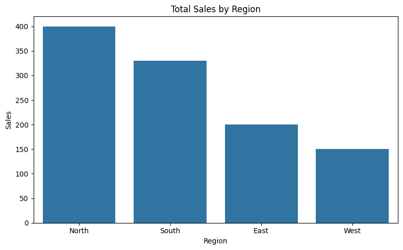
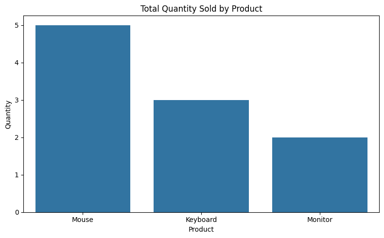
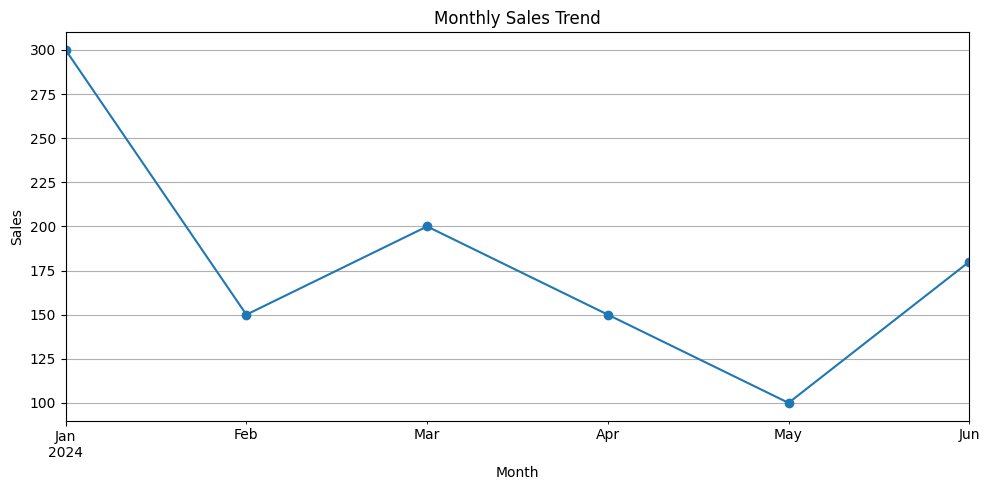

# 📊 Sales Insights Dashboard – Python & Matplotlib

A beginner-friendly data analysis project to explore and visualize sales performance across different regions and products using Python, Pandas, and Matplotlib.

## 📁 Dataset

The dataset contains fictional sales data with the following columns:
- `Order ID`
- `Product`
- `Quantity`
- `Sales`
- `Region`
- `Date`

## 🔍 Key Questions Answered

- Which region generated the highest total sales?
- Which product had the highest quantity sold?
- What are the monthly trends in total sales?

## 📈 Visualizations

- Bar chart: Total Sales by Region
- Bar chart: Quantity Sold by Product
- Line chart: Monthly Sales Trend

## 📸 Sample Visuals

Here are some example charts from the analysis:

  
*Total Sales by Region*

  
*Total Quantity Sold by Product*

  
*Monthly Sales Trend*

## 🛠️ Tools Used

- Python
- Pandas
- Matplotlib
- Seaborn
- Jupyter Notebook
- VS Code

## 📁 Project Structure

```
Sales-Insights-Dashboard/
├── analysis.ipynb
├── sales_data.csv
├── README.md
└── images/
    ├── region_sales.png
    └── monthly_sales.png
```

## 👨‍💻 Author

Jami Bhargav Venkat  
GitHub: [bhargavjami](https://github.com/bhargavjami)

